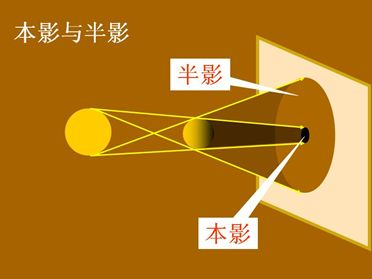
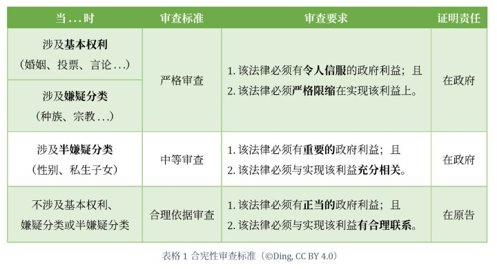
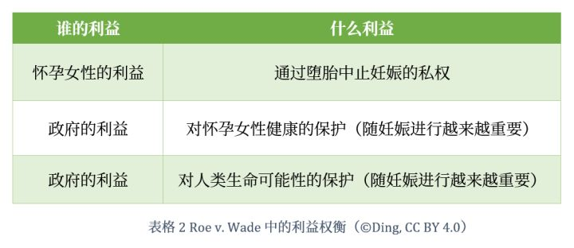
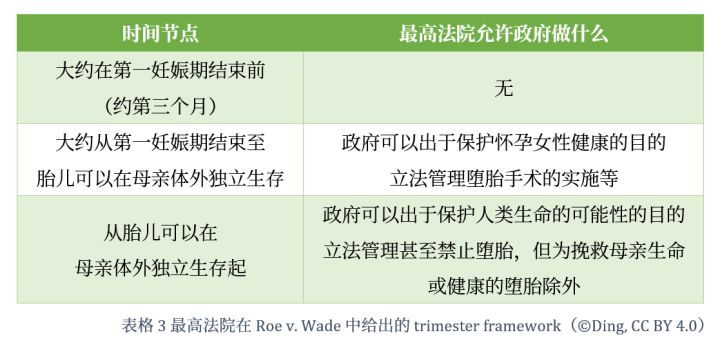

**作者：[Ding](https://www.dingphil.com/s/zhihu/)**

**编辑：陆贽**

[阿拉巴马州所谓「史上最严」反堕胎法案](https://mp.weixin.qq.com/s?__biz=MzIxMTA0NzIyNg==&mid=2650318375&idx=1&sn=f38a91a21b75711381e2894c1701d695&scene=21#wechat_redirect)最近都不会实际生效——它的合宪性会立刻遭到挑战，阿拉巴马当地联邦地区法院也很快会对该法发出 temporary restraining order（临时限制令）或 preliminary injunction（初步禁令）。

<!--more-->

美国最高法院在 1973 年的 Roe v. Wade, 410 U.S. 113 案中将宪法第十四修正案的 due process clause（正当程序条款）对 privacy（私权）的保护应用到中止妊娠的权利上。即使最高法院后来又在 1992 年的 Planned Parenthood v. Casey, 505 U.S. 833 案中对 Roe v. Wade 作出了修正，仍然很难想象阿拉巴马州能怎么狡辩说：

(1) 几乎全面禁止堕胎的法律**是**合宪的。

可以预见，stare decisis（遵循先例），下级法院将会判决该法违宪。甚至连签署法案的阿拉巴马州长 Kay Ivey 自己都大方地承认了这点，她在写给全阿拉巴马人的声明中写道：

> 无论每个人自己对堕胎的看法如何，我们都能认识到，至少短期来说，本法案可能也实施不了。[i]

既然实施不了，那为什么还要通过这项法律呢？Ivey 的解释相当直白，

> 许多美国人，包括我自己，都不同意 1973 年宣布的 Roe v. Wade。本法案的支持者相信是时候，又一次，让美国最高法院重温这个重要的问题，并且他们相信这次可能是实现这件事最好的机会。[ii]

易言之，阿拉巴马的法律是想要说:

(2) 几乎全面禁止堕胎的法律**应该是**合宪的，即使这样的法律现在并**不是**合宪的。

要做到这点，阿拉巴马就需要推翻前述的判例，尤其是 Roe v. Wade。于是，若不理解 Roe v. Wade，则阿拉巴马的法律也是不可理解的——它可真不是「中国女性地位这么高，田园女权却还狮子大开口」的佐证。

可 Roe v. Wade 究竟是怎么回事？许多人会说 Roe v.Wade 是美国堕胎合法化的开端，但这是一种常见的误解。在 Roe v. Wade 以前，堕胎合法化就已席卷十余个州——与其说 Roe v. Wade 是开端，更不如说它是高潮。也有人不加保留地说 Roe v. Wade 承认了堕胎的权利，但这也是一种常见的误解——最高法院从没在 Roe v. Wade 中认可过无限制的堕胎权利，也从没完全禁止公权力对私人堕胎权利的干涉。在本文中，我们向读者介绍美国堕胎法律的历史，特别是其背后所依赖的法理，以便读者在发泄「真恶心」外能更深入和有建设性地参与相关公共讨论。

## 早期的堕胎法律

可能很多人都不知道，像如今阿拉巴马这样的堕胎法律其实是相当晚近的创造。直到 1803 年，英国才第一次对堕胎的立成文法。在此以前，根据英美普通法的 **born alive** 规则，除非小孩是 born alive（活着出生）的，否则谋杀 TA 就是不可能的——非常简单的道理，人得活着（生下来），才能被杀。

于是，在 1803 年前的英国，要证明某（未出生的）小孩被谋杀了，就必须要证明这个孩子是活着出生的。而这显然是自相矛盾的，因此堕胎在普通法下不可能构成谋杀罪。实际上，根据通行的说法，直到 **quickening**（第一次胎动，大约是孕期的第四个月，胚胎的运动被认为是生命的迹象）为止，堕胎在普通法下甚至都不构成任何犯罪 [iii]。

当然，这一切在 1803 年都改变了。当年英国的立法 ***Lord Ellenborough’s Act***, 43 Geo. 3, c. 58 废除了在第一次胎动前堕胎不构成犯罪的普通法惯例。特别是，新的法律规定了在第一次胎动后实施堕胎是一项 felony（重罪），实施者应处死刑。

大洋彼岸年轻的美国效仿了英国的做法。1821 年，康涅狄格制定了全美第一条堕胎法律，规定在第一次胎动后实施堕胎可判处终身监禁 [iv]。随后伊利诺伊（1827 年）、纽约（1828 年）、佐治亚（1833 年）、俄亥俄（1834 年）等州也相继通过了各自禁止堕胎的法律 [v]。但直到 1840 年，也只有 8 个州颁布了禁止堕胎的法律，大部分堕胎法律要直到美国内战后才会出现 [vi]。在战后的日子里，对堕胎的惩罚会逐渐加重，普通法中接近妊娠晚期的「第一次胎动」也会逐渐被抛弃 [vii]。进入二十世纪，美国的全部 50 个州及哥伦比亚特区都实施了禁止堕胎的法律 [viii]。

彼时，除新泽西州外，堕胎都可能构成重罪 [ix]。路易斯安那、马萨诸塞、新泽西及宾夕法尼亚等 4 个州都立法全面禁止堕胎，且不设任何例外，尽管马萨诸塞和新泽西的最高法院随后都相继允许了为挽救母亲生命而实施堕胎的例外 [x]。其它 46 个州及哥伦比亚特区则都或多或少只允许为挽救母亲生命而实施堕胎 [xi]。

「挽救母亲生命」这一措辞特别需要读者特别记住。当时大多数堕胎法律都只允许此一种例外。而诸如被强奸后生下孩子所会导致的情感与经济伤害等，由于并不会危及「生命」，因此不构成例外。

早期堕胎的法律究竟是为了保护怀孕女性的生命还是为了保护孩子的生命，是个不太清楚的问题。至少在十九世纪，堕胎仍然相当危险，消毒用品的缺乏使得堕胎的死亡率居高不下 [xii]。要知道当时的死亡率具体有多高不是一件容易的事，在这里我们只能间接地来猜测。根据世界卫生组织的估计，在撒哈拉以南的非洲国家，每十万例不安全堕胎中就有 520 例孕妇死亡；在使用人工流产的美国，每十万例人工流产则仅有 0.6 例孕妇死亡 [xiii]——仅 867 分之一！而阿肯色、科罗拉多、伊利诺伊等 10 个州及哥伦比亚特区就要求堕胎必须由医生来实施，似乎至少某些州的堕胎法律是旨在保护怀孕女性生命的 [xiv]。可是，也至少 31 个州允许任何人实施堕胎，其立法目的更像是保护孩子的生命 [xv]。

## Roe v. Wade 前的六年间

自 1967 年起，变革迅即发生了。社会变革如何引发法律变革是极为迷人的课题，也十分适合充当励志煽情文绝佳的素材，但我们在本文中选择克制，不去猜测变革的原因，仅考察变革本身。

当年英国通过的 ***Abortion Act 1967***, 15 & 16 Eliz. 2, c. 87 允许了比「挽救母亲生命」远远更宽泛的「身体与情感伤害」，俄勒冈州随即效仿了英国的作法 [xvi]。最值得一提的是，阿拉斯加、纽约、夏威夷和华盛顿等 4 个州相继在 1970 年取消了「挽救母亲生命」等证成要求，基本实现了堕胎的非罪化 [xvii]。至 1973 年，已有十余个州或多或少放宽了堕胎的限制。

现在大多数人会认为最重要的事件发生在 1973 年1 月 22 日。这一天，美国最高法院在 Roe v. Wade 一案的判决中宣布女性通过堕胎以中止妊娠的权利受到宪法第十四修正案的保护，而数十个州只允许为挽救母亲生命而堕胎的法律因此都是违宪的 [xviii]。但把 Roe v. Wade 看作美国堕胎合法化的开端却是一种常见的误解。一方面，因为禁止堕胎的法律在 Roe v. Wade 宣判前就在多个州有所放松，堕胎数量已开始激增（见下图）。

另一方面，Roe v. Wade 也不是从石头缝里凭空蹦出来的。不理解 Roe v. Wade 的先例，则 Roe v. Wade 所依赖的法理也就是不可理解的。通常认为最重要的是 1965 年的 **Griswold v. Connecticut**, 381 U.S. 479 案。彼时的康涅狄格州有法律全面禁止避孕，即使已婚夫妇采用避孕手段也是犯罪：

> 任何人使用任何药物、药用品或工具以实现避孕目的的，应处五十美元以上的罚款  （注：1973 年的 50 美元大约相当于今天的 287.78 美元），或处六十天以上、一年以下的监禁，或并处罚金与监禁。[xix]

最高法院在 Griswold v. Connecticut 案中判决康涅狄格的法律违宪，理由是公权力不可以随意干涉受宪法保护的 zone of privacy（私人地带）[xx]。道格拉斯大法官在多数意见中著名地质问道：

> Would we allow the police to searchthe sacred precincts of marital bedrooms for telltale signs of the use of contraceptives? The very idea is repulsive to the notions of privacy surrounding the marriage relationship. 难道我们要允许警察搜查婚房这样的圣地，寻找避孕品使用的蛛丝马迹吗？这种想法本身就与婚姻关系的私人性背道而驰。[xxi]

易言之，发生在卧室床上的事情是个人的私事和自由，公权力管不着。但是，宪法及修正案中都没有任何条款直接提到了「privacy」（私人/私权）这个字眼。那么，宪法究竟是怎样保护私权或「私人地带」的呢？道格拉斯用了一个相当新颖和费解的光学名词来解释——「**penumbra**」（半影）：

> [T]he First Amendment has a penumbra where privacy is protected from governmental intrusion. 第一修正案有一道半影，私权在其中受到保护，不被公权力侵犯。[xxii]  [S]pecific guarantees in the Bill of Rights have penumbras, formed by emanations from those guarantees that help give them life and substance. 权利法案中的某些保证具有半影，它们是由这些保证所发出的光所构成的，赋予这些保证以生命与实体。[xxiii]

图表 2 半影（©爱我所爱，CC BY-SA 3.0）

据维基百科的说法，半影是「发光体（非点光源）所发出光线部分被非透明物体阻挡后，在屏幕（或其他物体）上所投射出来的，本影周围较暗的区域」。当然，我们才不会在这里放言说我们完全理解「半影」究竟是什么意思，但读者可以尽情想象这一微妙的用词会带来多大的争议与不确定性。在他的反对意见中，斯图尔特大法官便一针见血地指出，即使多数意见引用了第一、第三、第四、第五、第九和第十四等一箩筐修正案作为证成，可它却到最后也没有说清楚康涅狄格的法律究竟违反了哪一条修正案 [xxiv]。

## **Roe v. Wade**

普通法最为人所知的原则大概就是「stare decisis」（遵循先例）了。于是，当最高法院在数年便再次遭遇私权利与公权力的冲突时，遵循 Griswold v. Connecticut 案所投射出的「半影」也不足为怪了。

1970 年 3 月，一位化名 Jane Roe 的女性对德克萨斯州禁止堕胎的法律发起 facial challenge [xxv]，即要求法院判决该法律不仅仅在 Roe 本人的情况中是违宪的，而且在任何情况下都是违宪的——所谓「facially unconstitutional」（字面上看就违宪）。彼时德州禁止堕胎的法律是标准的前述中仅允许「挽救母亲生命」这一种例外的类型，而除德州外还有 29 个州施行着禁止堕胎的法律 [xxvi]。

与此同时，一位化名 Mary Doe 的女性在佐治亚州也发起了类似的诉讼。因为二者的相似性，最高法院一起听取了两个案子的口头辩论，并在 1973 年同日宣判。但 Roe 案成为了重心，主要原因是Roe 案中德州的法律比 Doe 案中佐州的法律更为严格（这也是阿拉巴马州要制定那样严格的堕胎法律的最重要原因）。佐州法律除允许为挽救母亲生命堕胎外，还允许因为强奸及严重的先天缺陷而堕胎 [xxvii]，而两后者是德州法律所不允许的。

在 Roe 案中，代表德州被起诉的是达拉斯县的地方检察官 Henry Wade，因此该案是 Roe v. Wade（本案还有别的原告方，但为了避免把案件过分复杂化，我们在本文中只考虑 Roe）。Roe 向法院称，德州禁止堕胎的法律限制了她的「right of personal privacy」（个人私权），而该权利受到宪法第一、第四、第五、第九和第十四修正案保护 [xxviii]。

当然，连最高法院在 Griswold v. Connecticut 案中都没有说清楚具体是哪条修正案的哪个条款保障了 privacy，要求 Roe 来说清未免强人所难。事实上，最高法院在本案中注意到，上述 5 条修正案中都没有任何一个字眼提到「privacy/私权」——其实，

> The Constitution does not explicitly mention any right of privacy. 宪法没有明确提到任何的私权。[xxix]

但是，最高法院很快便遵循 Griswold v. Connecticut 等案所投出的半影，

> In a line of decisions, however, . . . the Court has recognized that a right of personal privacy, or a guarantee of certain areas or zones of privacy, does exist under the Constitution. 可是，在一系列判决中， . . . 本院认可一种个人私权，或者说一种对某些领域或私人地带的保护，确实存在于宪法之下。[xxx]

既然承认了 privacy，那么就只需要判断通过堕胎中止妊娠是不是包括在 privacy 内——最高法院认为这是「显然的」；并且，最高法院认为无论具体是哪条修正案保障了privacy，都不会对本案有影响：

> This right of privacy, whether it be founded in the Fourteenth Amendment's concept of personal liberty and restrictions upon state action, as we feel it is, or, as the District Court determined, in the Ninth Amendment's reservation of rights to the people, is broad enough to encompass a woman's decision whether or not to terminate her pregnancy. 这种私权，无论是像我们所感觉的那样，应该从第十四修正案个人自由的概念里找，还是像地区法院所判决的那样，从第九修正案人民保留 [宪法所没有规定的] 权利里找，都足够容得下一位女性要不要中止妊娠的决定。州政府完全否认这种选择，会给怀孕女性造成的伤害是显然的。[xxxi]

通过认可宪法（特别是第十四修正案的 due process clause [正当程序条款]）保障私权，认为私权包括通过堕胎中止妊娠的权利，最高法院便因此认可了宪法保障通过堕胎中止妊娠的权利 [xxxii]。需要读者注意的是，像这样的权利是一种 **negative liberty right**（消极自由权利），意思是个人可以自由决定要不要中止堕胎，而公权力和/或他人不能干涉——同时，公权力和/或他人也没有义务积极促进这项权利的行使。这点在下一节中在对 Hyde Amendment 的介绍中将会格外重要。

可是，从来都不是说一项权利受到宪法的保护，这项权利就完全、永远不受到任何的限制了。最为人所知的大概是宪法第一修正案对言论自由的保护，不过诽谤也是言论，却不受第一修正案的保护。并且，不是所有的宪法权利都受到相同程度的保护。权利的重要性不同，法院在进行 judicial review（司法/合宪性审查）时采用的标准也不同。最严格的标准是——如名字所示——「strict scrutiny」（严格审查）。只有在某项法律涉及到某「fundamental right」（基本权利），或者涉及某「suspect class」（嫌疑分类，包括种族、宗教等）时，法院才会采取 strict scrutiny。我们使用下表向读者解释不同程度的 judicial review 标准：

受到宪法第十四修正案 due process clause（正当程序条款）保护的权利通常都是 fundamental rights。而在本案中，最高法院亦认为堕胎是一项 fundamental right [xxxiii]。那么，问题就在于德州政府在限制堕胎上是否有「compelling government interest」（令人信服的政府利益），且该限制堕胎的法律是否 narrowly tailored（严格限缩）在了实现该利益上 [xxxiv]。

德州政府提供了两个不同的论证来为其堕胎法律辩护。在第一个论证中，德州政府认为，未出生的孩子是「人」，而宪法第十四修正案保护人的生命，因此保护未出生孩子的生命有 compelling government interest [xxxv]。但法院很快注意到，这个论证并不成立——其问题在于，第十四修正案是这样说的：

> All persons **born** or naturalized in the United States and subject to the jurisdiction thereof, are citizens of the United States and of the State wherein they reside . . . nor shall any State deprive any person of life, liberty, or property, without due process of law . . . 所有在合众国**出生**或归化合众国并受其管辖的人，都是合众国的和他们居住州的公民。任何一州 . . . 不经正当法律程序，不得剥夺任何人的生命、自由或财产 . . . [xxxvi]

标粗的部分值得特别注意——只有**出生的人**才享有生命、自由和财产的宪法保障，而未出生的孩子根本就不受第十四修正案保护 [xxxvii]。

在第二个论证中，德州政府主张，生命从受精的那一刻就开始了，而在妊娠期间保护这个生命是 compelling government interest [xxxviii]。法院立刻意识到「生命从哪一刻开始」是个极具争议、没有定论的问题，而德州政府不可以用一套这么有争议的理论限制怀孕女性的私权 [xxxix]。在依次考察斯多葛学派、犹太教、新教、普通法、医学、亚里士多德、天主教等在这个问题上的看法，又考虑 tort law（侵权法）对相关问题的处理后，法院虽然仍拒绝对「生命从哪一刻开始」作出明确回答，但最终裁定未出生者并不在完整的意义上算是人 [xl]。然而，法院同时认可政府可以有important and legitimate interest（重要的和正当的利益）保护「potentiality of human life」（人类生命的可能性）[xli]。注意这里的「重要的」和「正当的」分别对应上表中的「中等审查」和「合理依据审查」。

此外，法院还认可了政府可以有管理医疗实践以保护怀孕女性健康的利益 [xlii]。

法院告诉我们，保护人类生命的可能性与保护怀孕女性健康这两种利益的重要性并非是一成不变的，它们会随着孕期的推进变得越来越重要，直至 compelling [xliii]。易言之，本案中有三种相互冲突的利益需要权衡：

最高法院判断，保护怀孕女性健康的政府利益从大约第一妊娠期（约第三个月）结束起构成一项 compelling government interests；自此时间节点开始，要求诸如堕胎必须由医生在医院实施等的法律可以通过 strict scrutiny，是合宪的 [xliv]。另一方面，保护人类生命的可能性的政府利益从胎儿可以在母亲体外独立生存（约第六至七个月）起构成一项 compelling government interests；自此时间节点开始，禁止堕胎的法律可以通过 strict scrutiny，是合宪的 [xlv]。我们总结在下表中：

由此，最高法院宣判德克萨斯州仅允许为挽救母亲生命而堕胎的法律违宪 [xlvi]。而无论是本周阿拉巴马无限制禁止堕胎的法律，还是肯塔基、密西西比、俄亥俄、佐治亚、密苏里等州禁止在胎儿出现心跳（约第五至六周）后堕胎的法律，亦都直接与最高法院在 Roe v. Wade 中的判决冲突。

如立法者自己所坦白的那样，通过这些法律的目的就是要直接对 Roe v. Wade 发起挑战。要更好地理解这些近来的挑战，我们继续向读者介绍 Roe v. Wade 后美国的堕胎司法与立法。

## Roe v. Wade 以后

自 1976 年起，美国国会多次通过立法禁止 Medicaid（联邦医保）报销堕胎费用。因其发起者是伊利诺伊州众议员 Henry Hyde，故称为 **Hyde Amendment**。例如，1980 年的 Hyde Amendment 规定，

> [N]one of the funds provided by this joint resolution shall be used to perform abortions except where the life of the mother would be endangered if the fetus were carried to term, or except for such medical procedures necessary for the victims of rape or incest when such rape or incest has been reported promptly to a law enforcement agency or public health service. 本 [众议院和参议院的] 联合决议所提供的资金都不得用于实施堕胎，除非若胎儿足月生产，母亲会生命垂危；或除非这样的医疗程序对强奸或伦乱的受害者是必要的，但要这样的强奸或乱伦及时向执法机构或公共卫生机构报告。[xlvii]

注意，不同年份的 Hyde Amendment 都可能有所不同，如 1977 年的版本就没有允许强奸或伦乱的例外 [xlviii]。但在 1980 年的 Harris v. McRae, 448 U.S. 297 一案中，最高法院（除了其它问题之外还）认为 Hyde Amendment 没有侵犯其在 Roe v. Wade 所承认的消极堕胎自由。根据最高法院的意思，只要政府没有刻意制造障碍阻止堕胎，就没有侵犯到堕胎的自由，而堕胎的费用并不是政府所制造的障碍 [xlix]。

两年后，宾夕法尼亚州通过了 *Pennsylvania Abortion Control Act of 1982*, 18 Pa. Cons. Stat.§§ 3203–3220（后经 1988 年和 1989年修正），该法除其它规定外特别要求

(1)  **知情同意**：寻求堕胎的女性必须对堕胎给出知情同意，包括被告知堕胎的「替代方案」； (2)  **家长同意**：若寻求堕胎的女性尚未成年，则需家长对堕胎给出知情同意，但若不能或不愿意告诉家长，也可寻求法官判决豁免； (3)  **24 小时等待期**：知情同意必须最晚在堕胎手术的 24 小时前给出； (4)  **通知配偶**：除特殊情况外，寻求堕胎的已婚女性必须通知配偶计划堕胎一事。[l]

此外，若孕妇情况危急，则上述要求都可豁免 [li]。该法在当地被起诉，地区法院判决上述要求均违宪，上诉法院却认为只有通知配偶这一项要求违宪 [lii]。在内部分歧极大的判决 Planned Parenthood v. Casey, 505 U.S. 833 (1992) 中，最高法院部分遵从 Roe v. Wade 先例，重申女性在第一次胎动前可以自由堕胎，但也重申政府有利益保护「**the life of a fetus that may become a child**」（可能变成小孩的胎儿的生命），且在第一次胎动后该利益便可以优先于女性的堕胎自由[liii]。

但是，最高法院还认为 Roe v. Wade 中给出的 trimester framework 过于苛刻（见上节），「undervalues the State’s interest in the potential life within the woman」（低估了政府 [保护] 女性体内的潜在生命的利益）[liv]。于是，最高法院在本案中推翻了 Roe v. Wade 对堕胎自由所采用的 strict scrutiny 审查，转而采用严格程度更低的「undue burden」（不正当负担）审查：

> Only where state regulation imposes an undue burden on a woman's ability to make this decision [of abortion] does the power of the State reach into the heart of the liberty protected by the Due Process Clause. 只有在政府规定往女性作出 [堕胎] 决定的能力上施加不正当负担的情况下，政府的权力才侵入了正当程序条款所保护的自由的心脏。 [lv]  The very notion that the State has a substantial interest in potential life leads to the conclusion that not all regulations must be deemed unwarranted. Not all burdens on the right to decide whether to terminate a pregnancy will be undue. In our view, the undue burden standard is the appropriate means of reconciling the State's interest with the woman's constitutionally protected liberty. 从政府在 [保护] 潜在生命上有重要的利益这个念头本身就可以得出结论说，不是所有 [限制堕胎] 的规定都必须被视为无理的。不是所有施加在决定要不要中止堕胎的权利上的负担都是不正当的。在我们看来，不正当负担的标准是调和政府利益与女性受宪法保护的自由的合适工具。 [lvi]

那么，什么样的堕胎法律才算是 impose undue burden 呢？最高法院的回答是，

> A finding of an undue burden is a shorthand for the conclusion that a state regulation has the purpose or effect of placing a substantial obstacle in the path of a woman seeking an abortion of a nonviable fetus. 判决为不正当负担，其实就是说得出这样的结论：某政府立法的目的或效果是给寻求堕掉非胎动的胎儿的女性的道路上增添相当大的障碍的。[lvii]

用非技术性的语言表达，也就是说只要女性还是能相对自主地堕胎，政府就不算无理侵犯了她的堕胎自由：

> What is at stake is the woman's right to make the ultimate decision, not a right to be insulated from all others in doing so. 重要的是女性作出最终决定的权利，而非免受其他任何人干涉的权利。[lviii]

在新的标准下，只要不会制造 substantial obstacle 或 undue burden，政府就可以立法限制第一妊娠期内的堕胎，而这曾是 Roe v. Wade 所不允许的。

几年后的1995 年，美国国会通过了 *Partial-Birth Abortion Ban Act*，禁止中止中期妊娠所用的一种手术——intact dilation and evacuation（完整扩张和抽取术）。这是在 Roe v.Wade后，国会第一次立法禁止某种堕胎手术 [lix]。但时任总统克林顿 veto（否决）了该法，使其未能生效。

2003 年，国会再度通过了该法，并由小布什总统签署生效，*Partial-Birth Abortion Ban Act of 2003*, 18 U.S.C. § 1531。该法的合宪性随即在法庭上遭到挑战。最终，最高法院在 **Gonzales v. Carhart**, 550 U.S. 124 (2007) 中以 5 比 4 判决该法合宪，最重要的是因为禁止这一种堕胎手术并不会给寻求堕胎的女性造成 substantial obstacle，因此不构成 undue burden [lx]。这亦是在 Roe v. Wade 后，最高法院第一次维持禁止某种堕胎手术的立法 [lxi]。

2013 年，德克萨斯议会通过了 House Bill 2 (H.B. 2)，以限制堕胎诊所的运作。德州因该法案的两项要求而被告上了法庭：

(1)  **医师资格**：实施堕胎的医师必须在堕胎实施地 30 英里（48 公里）之内的医院享有 admitting privileges（接受病人住院的资格）；[lxii] (2)  **手术设施**：实施堕胎的设施必须达到 ambulatory surgical center（门诊手术中心）的标准。[lxiii]

初审法院发现，在 H.B. 2 通过前，德克萨斯州（大约有 540 万生育年龄的女性）就只有 40 多个堕胎诊所；H.B. 2 的医师资格要求直接将这一数字斩半，而再加上手术设施的要求（极为昂贵，每个诊所每年大约需要 150 至 300 万美元才能达到要求），就只有休斯顿、奥斯丁、圣安多尼奥、达拉斯、沃斯堡等 5 个大城市的 7 个（可能有第 8 个）堕胎诊所能合法运行了 [lxiv]。让这 7、8 个诊所承担整个州每年 60000 至 72000 例堕胎是根本不可能的，特别是不居住在城市里的女性更是难上加难——将有 200 万人居住地周围 80 公里以内都不会有堕胎设施，比法案通过前要多一倍 [lxv]。

初审法院据此认为德州法律的手术设施要求给女性行使堕胎权利制造了 undue burden，是 facially unconstitutional（字面上看就违宪）；而医师资格要求，在与手术设施要求一起应用到 Rio Grande Valley、El Paso、West Texas 等地的女性上时，给她们行使堕胎权利制造了 undue burden，是 unconstitutional as applied（应用到具体情况上后违宪）[lxvi]。上诉法院则以 res judicata（既判力）等程序问题大幅推翻了初审法院的判决 [lxvii]。

在 **Whole Woman’s Health v. Hellerstedt**, 579 U.S. ___ (2016) 中，最高法院最终以 5 比 3 判决程序问题不成立，且手术设施和医生资格两项要求都构成 undue burden，因此违宪 [lxviii]。

## 结语

这样，我们就来到了 2019 年。肯塔基、密西西比、俄亥俄、佐治亚、密苏里等州相继立法禁止在胎儿第一次心跳后堕胎（大约第五或第六周）。阿拉巴马则更进一步，其 *Human Life Protection Act*, House Bill 314 几乎全面禁止了堕胎。美国女性争取堕胎权利的路程如此曲折，这是否又侧面证明了社会主义的优越性呢？

我们无法同意。与其期望政府在每个问题上都与自己不谋而合，不如期望在公权力过分侵犯私人权利时有公正、可靠的救济渠道存在。由独立的司法系统实施宪法审查，就能保证提供这样的救济渠道。

从 Merrick Garland、Brett Kavanaugh 等的最高法院提名我们知道，美国最高法院也日益党派化，甚至连美国总统也开始将法官分成「奥巴马法官」「布什法官」等等，这是否是民主国家不可避免的宪法危机，又从侧面证明了社会主义的稳定性呢？

我们还是无法同意。真正的宪法危机会是美国总统不再服从司法系统。桀骜不驯如特朗普，在行政命令被下级法院判决违宪时大多时候也只能一边听命一边打官司。这是宪法仍然统治美国的最好证明。

（本文首先发表于 Herstoria 上，[理解美国堕胎史：美国堕胎合法化始于1973年罗伊诉韦德案？](https://mp.weixin.qq.com/s/4kqDerIAN36jprqvXiApnQ)）

## 注释

[i] Governor Ivey Issues Statement After Signing the Alabama Human Life Protection Act, Office of the Governor (May 15, 2019), https://governor.alabama.gov/statements/governor-ivey-issues-statement-after-signing-the-alabama-human-life-protection-act/.

[ii] Id.

[iii] Loren G. Stern, Abortion: Reform and the Law, 59 J. Crim. L. & Criminology 84, 84 (1968); William J. Maledon, Law and the Unborn Child: The Legal and Logical Inconsistencies, 46 Notre Dame L. Rev. 349, 363 (1971).

[iv] Stern, supra note 3, at 84–85.

[v] Id. at 85; Roe v. Wade, 410 U.S. 113, 175 (1973), Rehnquist, J., dissenting.

[vi] Roe v. Wade, 410 U.S. at 138–39.

[vii] Id. at 139.

[viii] Maledon, supra note 3, at 365.

[ix] Stern, supra note 3, at 86.

[x] B. James George Jr., Current Abortion Laws: Proposals and Movements for Reform, 17 Case W. Res. L. Rev. 371, 375 (1965).

[xi] Id. at 376.

[xii] Roe v. Wade, 410 U.S. at 148–49.

[xiii] World Health Organization, Unsafe Abortion: Global and Regional Estimates of the Incidence of Unsafe Abortion and Associated Mortality in 2008, at 30 (2011).

[xiv] George, supra note 10,at 377.

[xv] Id.

[xvi] Ruth Roemer, Abortion Law Reform and Repeal: Legislative and Judicial Developments., 61 Am J Public Health 500, 500 (1971).

[xvii] Id.

[xviii] Roe v. Wade, 410 U.S. 113 (1973).

[xix] Conn. Gen. Stat. § 53-32(1958).

[xx] Griswold v. Connecticut, 381 U.S. 479 (1965).

[xxi] Id. at 485–86.

[xxii] Id. at 483.

[xxiii] Id. at 484.

[xxiv] Id. at 527–28, Stewart P.,dissenting.

[xxv] Roe v. Wade, 410 U.S. 113, 120 (1973).

[xxvi] Id. at 118–19, fn. 2.

[xxvii] Doe v. Bolton, 410 U.S. 179, 183 (1973).

[xxviii] Roe v. Wade, 410 U.S. at 120.

[xxix] Id. at 152.

[xxx] Id.

[xxxi] Id. at 153.

[xxxii] Id. at 154.

[xxxiii] Id. at 155.

[xxxiv] Id.

[xxxv] Id. at 156.

[xxxvi] U.S. Const. amend. XIV § 1.

[xxxvii] Roe v. Wade, 410 U.S. at 157–58.

[xxxviii] Id. at 159.

[xxxix] Id.

[xl] Id. at 160–62.

[xli] Id. at 162.

[xlii] Id.

[xliii] Id. at 162–63.

[xliv] Id. at 163.

[xlv] Id. at 163–64.

[xlvi] Id. at 166.

[xlvii] Harris v. McRae, 448 U.S. 297, 302 (1980).

[xlviii] Id. at 302–3.

[xlix] Roe v. Wade, 410 U.S. at 298.

[l] 18 Pa. Cons. Stat. §§ 3205–3206, 3209 (1990).

[li] Id. sec. 3203.

[lii] Planned Parenthood v. Casey, 505 U.S. 833, 833 (1992).

[liii] Id. at 834.

[liv] Id. at 874–75.

[lv] Id. at 874.

[lvi] Id. at 876.

[lvii] Id. at 877.

[lviii] Id.

[lix] Frequently Asked Questions: U.S. Supreme Court Upholds Federal Ban on Abortion Methods, American Civil Liberties Union, https://www.aclu.org/other/frequently-asked-questions-us-supreme-court-upholds-federal-ban-abortion-methods.

[lx] Gonzales v. Carhart, 550 U.S. 124, 3–7 (2007).

[lxi] Frequently Asked Questions: U.S. Supreme Court Upholds Federal Ban on Abortion Methods, supra note 59.

[lxii] Tex. Health & Safety CodeAnn. § 171.0031(a) (2015).

[lxiii] Id. sec. 245.010(a).

[lxiv] Whole Woman’s Health v. Hellerstedt, 579 U.S. ___, 4–5, 7 (2016).

[lxv] Id. at 5–6.

[lxvi] Id. at 7.

[lxvii] Id. at 8–10.

[lxviii] Id. at 2–3.

